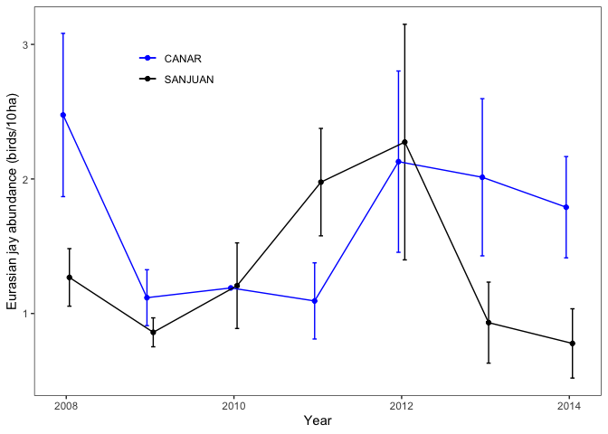
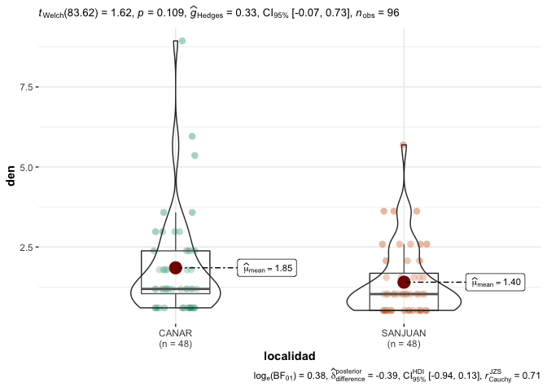

Garrulus data
================

``` r
knitr::opts_chunk$set(echo = TRUE, 
                      warning = FALSE, 
                      message = FALSE)
```

``` r
library("tidyverse")
library("here")
library("car")
library("report")
library("plotrix")
library("broom")
library("kableExtra")
library(ggstatsplot)
library(statsExpressions)
library(plotrix) #std.error 
library("flextable")
```

## Data sources

*Obsnev bird censuses* provided by [*OBSNEV*](https://obsnev.es/),
realized in several transects distributed along Sierra Nevada. Temporal
range from 2008 to 2020. The data were downloaded from new information
system of OBSNEV (*i.e.* PostgreSQL [db01.obsnev.es](db01.obsnev.es))

### Prepare OBSNEV bird censuses

-   Raw data were downloaded from OBSNEV information system. The
    downloaded tables were: `contactos_paseriformes.csv`;
    `dicc_especies.csv`; `geo.csv`; `visitas.csv`.

-   The protocol sampling number for passerine in the database is 5.

-   Select the two locations: “Cortijo del Hornillo” (SANJUAN),
    “Robledal de Canar” (CANAR)

-   Select only the taxonomic level = species (level &gt; 6)

-   Filter out data contacted over 30 m

``` r
contactos <- read_csv(here::here("data/birds/contactos_paseriformes.csv")) %>% 
  dplyr::select(-fcreacion, -fmodificacion)

dicc_sp <- read_csv(here::here("data/birds/dicc_especies.csv")) %>% 
  dplyr::select(idesp, nombre_cientifico, nivel)

# El protocolo de paseriformes es el 5
dicc_visita <- read_csv(here::here("data/birds/visitas.csv"), 
                        col_types = 
                          cols(.default ="?", 
                               idgeo = col_character(), 
                               fvisita = col_datetime(format="%Y-%m-%d %H:%M:%S"))) %>%
  filter(protocolo == 5) 
  
dicc_geo <- read_csv(here::here("data/birds/geo.csv"), 
                     col_types = cols(.default ="?", 
                               longitud_m = col_double()))

visita_geo <- 
  dicc_visita %>% inner_join(dicc_geo, by = "idgeo") %>% 
  dplyr::select(idvisitas, fvisita, nombre, longitud_m) 

dfraw <- contactos %>% 
  inner_join(visita_geo, by = "idvisitas") %>% 
  inner_join(dicc_sp, by = "idesp") %>% 
  mutate(year = lubridate::year(fvisita), 
         mes = lubridate::month(fvisita))

df <- dfraw %>% 
  filter(nombre %in% c("Cortijo del Hornillo", "Robledal de Cáñar")) %>% 
  mutate(habitat = case_when(
    stringr::str_detect(nombre, "Hornillo") ~ "SANJUAN",
    stringr::str_detect(nombre, "Cáñar") ~ "CANAR")) %>% 
  mutate(year = lubridate::year(fvisita), 
         mes = lubridate::month(fvisita),
         fecha = strftime(fvisita, format="%Y-%m-%d")) %>% 
  filter(nivel > 6) %>% 
  filter(desplazamiento < 31)
```

-   Aggregated data to get the sum of all contacts for a specie recorded
    in the same visit of the same transect

-   Select data from 2008 to 2014

``` r
garrulus <- df %>% 
  filter(nombre_cientifico == "Garrulus glandarius") %>% 
  group_by(fecha, year, mes, longitud_m, nombre, habitat, nivel) %>%
  summarise(total_ind = sum(numero)) %>%  
  mutate(den = round((total_ind * 10000 * 10 / (longitud_m * 60)),2)) %>% 
  ungroup() %>% 
  rename(localidad = habitat) %>% 
  dplyr::select(-nivel, -longitud_m, -nombre, -total_ind) %>% 
  filter(year > 2007) %>% 
  filter(year < 2015)
```

# Aggregate by year

``` r
garrulus_by_year <- garrulus %>% 
  group_by(localidad, year) %>% 
  summarise(mean = mean(den, na.rm = TRUE), 
            se = std.error(den), 
            n = length(den)) 
```

# Gráfico

``` r
pos <- position_dodge(0.15)
plot_garrulus <- garrulus_by_year %>% 
  rename(site = localidad) %>% 
  ggplot(aes(x=year, y=mean, colour=site)) + 
  geom_point(position = pos) +
  geom_errorbar(aes(ymin=mean-se, ymax=mean+se), 
                width=.1,position = pos) +
  geom_line(position = pos) + 
  theme_bw() +
  ylab("Eurasian jay abundance (birds/10ha)") + 
  xlab("Year") + 
  scale_color_manual(values=c("blue", "black")) + 
  theme(panel.grid = element_blank(),
        legend.position = c(.25,.85), 
        legend.title = element_blank()) 
print(plot_garrulus)
```

<!-- -->

## AOV

-   Ojo son unbalanced, usados type III

``` r
aov.unb <- aov(den ~ year * localidad, data = garrulus)
car::Anova(aov.unb, type ="III")
```

    ## Anova Table (Type III tests)
    ## 
    ## Response: den
    ##                 Sum Sq Df F value Pr(>F)
    ## (Intercept)      0.323  1  0.1715 0.6798
    ## year             0.307  1  0.1632 0.6872
    ## localidad        0.368  1  0.1956 0.6593
    ## year:localidad   0.365  1  0.1942 0.6605
    ## Residuals      173.053 92

``` r
report(aov.unb)
```

    ## The ANOVA (formula: den ~ year * localidad) suggests that:
    ## 
    ##   - The main effect of year is statistically not significant and very small (F(1, 92) = 0.01, p = 0.920; Eta2 (partial) = 1.10e-04, 90% CI [0.00, 0.01])
    ##   - The main effect of localidad is statistically not significant and small (F(1, 92) = 2.59, p = 0.111; Eta2 (partial) = 0.03, 90% CI [0.00, 0.10])
    ##   - The interaction between year and localidad is statistically not significant and very small (F(1, 92) = 0.19, p = 0.661; Eta2 (partial) = 2.11e-03, 90% CI [0.00, 0.04])
    ## 
    ## Effect sizes were labelled following Field's (2013) recommendations.

``` r
broom::tidy(aov.unb) %>% 
  kableExtra::kbl()
```

<table>
<thead>
<tr>
<th style="text-align:left;">
term
</th>
<th style="text-align:right;">
df
</th>
<th style="text-align:right;">
sumsq
</th>
<th style="text-align:right;">
meansq
</th>
<th style="text-align:right;">
statistic
</th>
<th style="text-align:right;">
p.value
</th>
</tr>
</thead>
<tbody>
<tr>
<td style="text-align:left;">
year
</td>
<td style="text-align:right;">
1
</td>
<td style="text-align:right;">
0.0190274
</td>
<td style="text-align:right;">
0.0190274
</td>
<td style="text-align:right;">
0.0101155
</td>
<td style="text-align:right;">
0.9201060
</td>
</tr>
<tr>
<td style="text-align:left;">
localidad
</td>
<td style="text-align:right;">
1
</td>
<td style="text-align:right;">
4.8785125
</td>
<td style="text-align:right;">
4.8785125
</td>
<td style="text-align:right;">
2.5935590
</td>
<td style="text-align:right;">
0.1107249
</td>
</tr>
<tr>
<td style="text-align:left;">
year:localidad
</td>
<td style="text-align:right;">
1
</td>
<td style="text-align:right;">
0.3652390
</td>
<td style="text-align:right;">
0.3652390
</td>
<td style="text-align:right;">
0.1941716
</td>
<td style="text-align:right;">
0.6605007
</td>
</tr>
<tr>
<td style="text-align:left;">
Residuals
</td>
<td style="text-align:right;">
92
</td>
<td style="text-align:right;">
173.0529951
</td>
<td style="text-align:right;">
1.8810108
</td>
<td style="text-align:right;">
NA
</td>
<td style="text-align:right;">
NA
</td>
</tr>
</tbody>
</table>

``` r
report_text(garrulus)
```

    ## The data contains 96 observations of the following variables:
    ##   - fecha: 96 entries, such as 2008-03-11 (n = 1); 2008-04-11 (n = 1); 2008-04-22 (n = 1) and 93 others (0 missing)
    ##   - year: n = 96, Mean = 2010.56, SD = 2.07, Median = 2011.00, MAD = 2.97, range: [2008, 2014], Skewness = 0.16, Kurtosis = -1.32, 0 missing
    ##   - mes: n = 96, Mean = 7.03, SD = 3.01, Median = 7.00, MAD = 4.45, range: [1, 12], Skewness = -0.06, Kurtosis = -1.12, 0 missing
    ##   - localidad: 2 entries, such as CANAR (n = 48); SANJUAN (n = 48); NA (0 missing)
    ##   - den: n = 96, Mean = 1.63, SD = 1.37, Median = 1.19, MAD = 0.89, range: [0.52, 8.94], Skewness = 2.54, Kurtosis = 9.06, 0 missing

``` r
ggbetweenstats(data=garrulus, 
               x=localidad, 
               y=den)
```

<!-- -->

``` r
garrulus_by_year %>% 
  ungroup() %>% 
  rename(avg=mean) %>% 
  group_by(localidad) %>% 
    summarise(mean = mean(avg, na.rm = TRUE), 
            se = std.error(avg), 
            n = length(avg)) %>% 
  kbl(digits = 3, booktabs = TRUE)
```

<table>
<thead>
<tr>
<th style="text-align:left;">
localidad
</th>
<th style="text-align:right;">
mean
</th>
<th style="text-align:right;">
se
</th>
<th style="text-align:right;">
n
</th>
</tr>
</thead>
<tbody>
<tr>
<td style="text-align:left;">
CANAR
</td>
<td style="text-align:right;">
1.687
</td>
<td style="text-align:right;">
0.210
</td>
<td style="text-align:right;">
7
</td>
</tr>
<tr>
<td style="text-align:left;">
SANJUAN
</td>
<td style="text-align:right;">
1.328
</td>
<td style="text-align:right;">
0.219
</td>
<td style="text-align:right;">
7
</td>
</tr>
</tbody>
</table>
