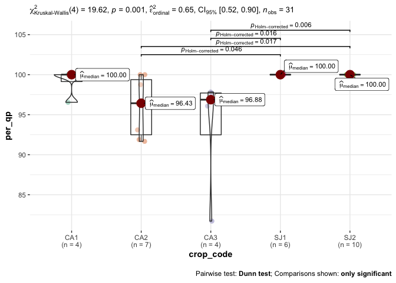
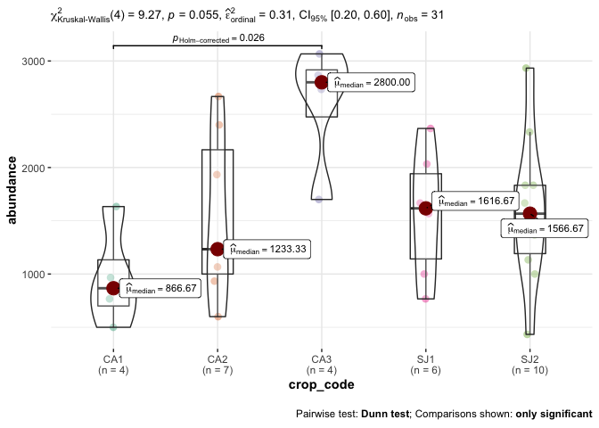
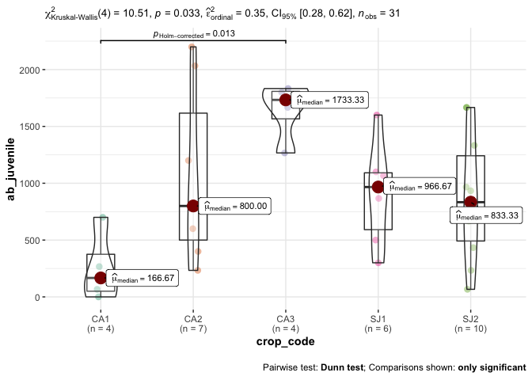
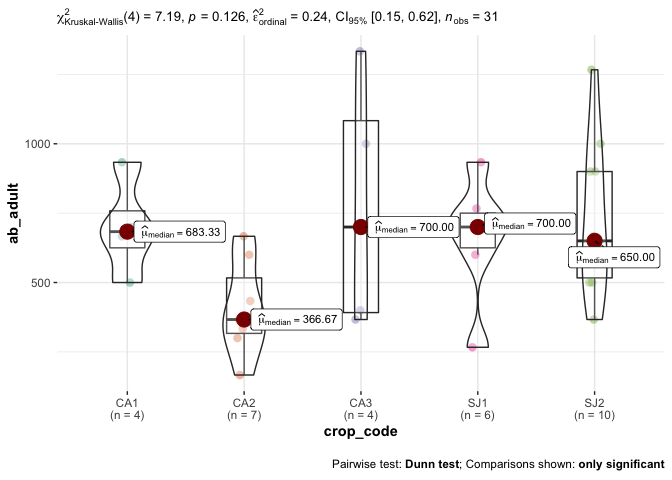
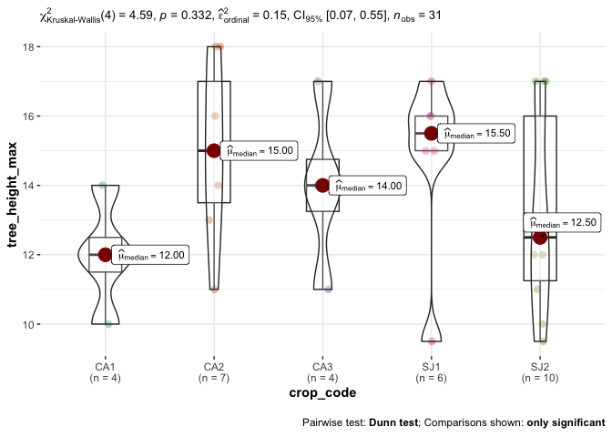
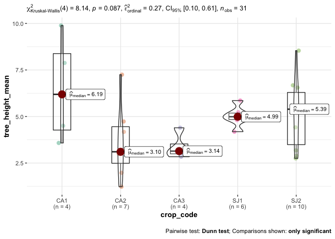
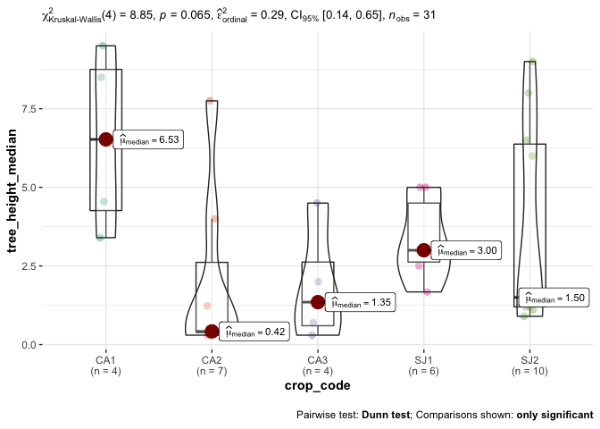
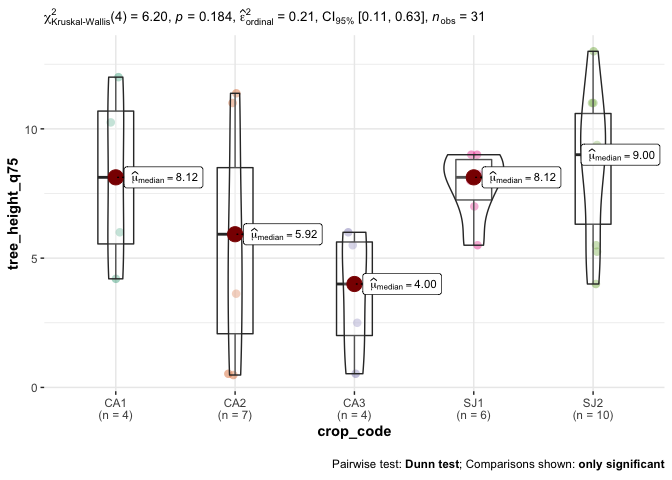
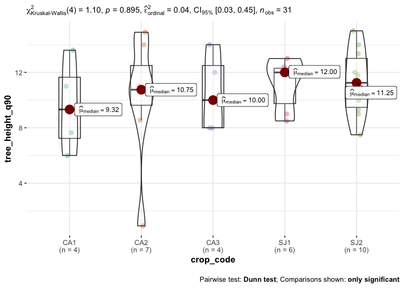
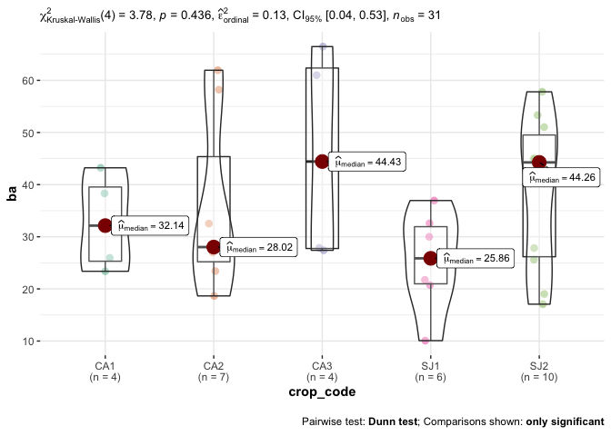

Compare Forest Structure
================

``` r
library(tidyverse)
```

    ## ── Attaching packages ─────────────────────────────────────── tidyverse 1.3.1 ──

    ## ✓ ggplot2 3.3.3     ✓ purrr   0.3.4
    ## ✓ tibble  3.1.2     ✓ dplyr   1.0.6
    ## ✓ tidyr   1.1.3     ✓ stringr 1.4.0
    ## ✓ readr   1.4.0     ✓ forcats 0.5.1

    ## ── Conflicts ────────────────────────────────────────── tidyverse_conflicts() ──
    ## x dplyr::filter() masks stats::filter()
    ## x dplyr::lag()    masks stats::lag()

``` r
library(here)
```

    ## here() starts at /Users/ajpelu/Google Drive/_phd/03_colonization/qpyr_coloniza

``` r
library(knitr)
library(kableExtra)
```

    ## 
    ## Attaching package: 'kableExtra'

    ## The following object is masked from 'package:dplyr':
    ## 
    ##     group_rows

``` r
library(ggstatsplot)
```

    ## You can cite this package as:
    ##      Patil, I. (2021). Visualizations with statistical details: The 'ggstatsplot' approach.
    ##      PsyArxiv. doi:10.31234/osf.io/p7mku

``` r
library(statsExpressions)
library(plotrix) #std.error 
library("flextable")
```

    ## 
    ## Attaching package: 'flextable'

    ## The following objects are masked from 'package:kableExtra':
    ## 
    ##     as_image, footnote

    ## The following object is masked from 'package:purrr':
    ## 
    ##     compose

``` r
# Select data from forest
# Remove data without values in altura field
forest <- read_csv(here::here("data/tree_data_crops.csv")) %>% 
  filter(tipo == 'ROBLEDAL') %>% 
  filter(!is.na(altura))  
```

    ## 
    ## ── Column specification ────────────────────────────────────────────────────────
    ## cols(
    ##   .default = col_character(),
    ##   id = col_double(),
    ##   altitud = col_double(),
    ##   altura = col_double(),
    ##   eje_mayor = col_double(),
    ##   eje_menor = col_double(),
    ##   diametro_base = col_double(),
    ##   porcentaje_herbivoria = col_double(),
    ##   edad = col_double(),
    ##   cesped = col_logical(),
    ##   edad_interpolada = col_double()
    ## )
    ## ℹ Use `spec()` for the full column specifications.

-   Analisis no paramétrico para cada variable dependiente

-   variables dependientes:

    -   \[\] abundancia total
    -   \[\] composicion (% de Q. pyrenaica)
    -   \[\] abundancia de juveniles
    -   \[\] media, mediana, max tree heigth
    -   \[\] BA (m2/ha)

``` r
# composition and abundance (ind /ha)
composition <- forest %>% 
  group_by(crop_code, localidad, especie, nombre) %>% 
  count() %>% 
  pivot_wider(names_from = especie, values_from = n) %>% 
  rowwise() %>% 
  mutate(ntotal = sum(encina,roble, na.rm = TRUE),
         per_qp = round(roble/ntotal*100, 2), 
         per_qi = ifelse(
           is.na(encina), 0, 
           round(encina/ntotal*100, 2)), 
         abundance = round(ntotal * 10000/300, 2)) 

# abundance Qp (ind/ha)
ab <- forest %>% 
  group_by(crop_code, localidad, especie, nombre, tree_type) %>% 
  count() %>% 
  mutate(n = n*10000/300) %>% 
  pivot_wider(names_from = tree_type, values_from = n) 

ab_roble <- ab %>% filter(especie=="roble") %>% 
  mutate(ab_juvenile = replace_na(juvenile, 0),
         ab_adult = replace_na(adult, 0)) %>% 
  dplyr::select(-juvenile, -adult,  -especie)
```

    ## Adding missing grouping variables: `especie`

``` r
# height
tree_height <- forest %>% 
  filter(especie == "roble") %>% 
  group_by(crop_code, localidad, nombre) %>% 
  summarise(tree_height_max = max(altura, na.rm = TRUE)/100,
            tree_height_mean = mean(altura, na.rm = TRUE)/100,
            tree_height_median = median(altura, na.rm = TRUE)/100,
            tree_height_q75 = quantile(altura, 0.75)/100,
            tree_height_q90 = quantile(altura, 0.9)/100)
```

    ## `summarise()` has grouped output by 'crop_code', 'localidad'. You can override using the `.groups` argument.

``` r
# BASAL AREA (m2/ha)
ba <- forest %>% 
  filter(especie == "roble") %>% 
  # filter(tree_type == "adult") %>% 
  mutate(ba_tree = (pi*diametro_base*diametro_base)/40000) %>% 
  group_by(crop_code, localidad, nombre) %>% 
  summarise(ba = ((sum(ba_tree))*10000)/300)
```

    ## `summarise()` has grouped output by 'crop_code', 'localidad'. You can override using the `.groups` argument.

``` r
forest_str <- composition %>% 
  dplyr::select(crop_code, localidad, nombre, per_qp, abundance) %>% 
  inner_join(ab_roble) %>% 
  inner_join(tree_height) %>% 
  inner_join(ba) %>% 
  dplyr::select(-especie)
```

    ## Joining, by = c("crop_code", "localidad", "nombre")

    ## Joining, by = c("crop_code", "localidad", "nombre")
    ## Joining, by = c("crop_code", "localidad", "nombre")

``` r
write_csv(forest_str, here::here("data/forest_structure.csv"))
```

# Summary by locality

``` r
ml <- forest_str %>% 
  group_by(localidad) %>% 
  summarise_at(vars(per_qp:ba), .funs = mean) %>% 
  pivot_longer(per_qp:ba, names_to = "variable", values_to = "mean") 

sl <- forest_str %>% 
  group_by(localidad) %>% 
  summarise_at(vars(per_qp:ba), .funs = std.error) %>% 
  pivot_longer(per_qp:ba, names_to = "variable", values_to = "se") 

statby_localidad <- ml %>% dplyr::inner_join(sl) %>% 
  mutate(across(where(is.numeric), round, 2)) %>% 
  unite("value", mean:se, sep=" ± ")
```

    ## Joining, by = c("localidad", "variable")

``` r
# Apply test 
variables_interes <- forest_str %>% ungroup %>% dplyr::select(per_qp:ba) %>% names()

test_localidad <- c() 

for (i in 1:length(variables_interes)){
  test <- two_sample_test(data = forest_str, 
                  x = localidad, 
                  y = !!variables_interes[i], paired = FALSE, type = "np")
  
  test_localidad <- rbind(test_localidad, test)
}
```

    ## Adding missing grouping variables: `crop_code`, `nombre`

    ## Adding missing grouping variables: `crop_code`, `nombre`
    ## Adding missing grouping variables: `crop_code`, `nombre`
    ## Adding missing grouping variables: `crop_code`, `nombre`
    ## Adding missing grouping variables: `crop_code`, `nombre`
    ## Adding missing grouping variables: `crop_code`, `nombre`
    ## Adding missing grouping variables: `crop_code`, `nombre`
    ## Adding missing grouping variables: `crop_code`, `nombre`
    ## Adding missing grouping variables: `crop_code`, `nombre`
    ## Adding missing grouping variables: `crop_code`, `nombre`

``` r
test_localidad <- test_localidad %>% rename(variable = parameter1)


forest_str_by_localidad <- statby_localidad %>% 
  pivot_wider(values_from = value, names_from = localidad) %>% 
  inner_join(test_localidad) %>% 
  dplyr::select(-expression) 
```

    ## Joining, by = "variable"

``` r
forest_str_by_localidad %>% 
  flextable(col_keys = c("variable","CANAR", "SANJUAN", "statistic", "p.value")) %>% 
  colformat_double(digits = 3)
```

    ## PhantomJS not found. You can install it with webshot::install_phantomjs(). If it is installed, please make sure the phantomjs executable can be found via the PATH variable.

``` r
forest_str_by_localidad %>% write_csv(here::here("data/forest_str_by_localidad.csv"))
```

# Summary by crop

``` r
m <- forest_str %>% 
  group_by(crop_code) %>% 
  summarise_at(vars(per_qp:ba), .funs = mean) %>% 
  pivot_longer(per_qp:ba, names_to = "variable", values_to = "mean") 

s <- forest_str %>% 
  group_by(crop_code) %>% 
  summarise_at(vars(per_qp:ba), .funs = std.error) %>% 
  pivot_longer(per_qp:ba, names_to = "variable", values_to = "se") 

statby_crop <- m %>% dplyr::inner_join(s) %>% 
  mutate(across(where(is.numeric), round, 2)) %>% 
  unite("value", mean:se, sep=" ± ")
```

    ## Joining, by = c("crop_code", "variable")

``` r
# Apply test 
variables_interes <- forest_str %>% ungroup %>% dplyr::select(per_qp:ba) %>% names()

test_crop <- c() 

for (i in 1:length(variables_interes)){
  test <- oneway_anova(data = forest_str, 
                  x = crop_code, 
                  y = !!variables_interes[i], paired = FALSE, type = "np")
  
  test_crop <- rbind(test_crop, test)
}
```

    ## Adding missing grouping variables: `localidad`, `nombre`

    ## Adding missing grouping variables: `localidad`, `nombre`
    ## Adding missing grouping variables: `localidad`, `nombre`
    ## Adding missing grouping variables: `localidad`, `nombre`
    ## Adding missing grouping variables: `localidad`, `nombre`
    ## Adding missing grouping variables: `localidad`, `nombre`
    ## Adding missing grouping variables: `localidad`, `nombre`
    ## Adding missing grouping variables: `localidad`, `nombre`
    ## Adding missing grouping variables: `localidad`, `nombre`
    ## Adding missing grouping variables: `localidad`, `nombre`

``` r
test_crop <- test_crop %>% rename(variable = parameter1)


forest_str_by_crop_code <- statby_crop %>% 
  pivot_wider(values_from = value, names_from = crop_code) %>% 
  inner_join(test_crop) %>% 
  dplyr::select(-expression) 
```

    ## Joining, by = "variable"

``` r
forest_str_by_crop_code %>%
  write_csv(here::here("data/forest_str_by_crop_code.csv"))


forest_str_by_crop_code %>%  flextable(col_keys = c("variable","CA1","CA2","CA3",
                         "SJ1","SJ2", "statistic", "p.value")) %>% 
  colformat_double(digits = 3)
```

    ## PhantomJS not found. You can install it with webshot::install_phantomjs(). If it is installed, please make sure the phantomjs executable can be found via the PATH variable.

### Per QP

``` r
ggbetweenstats(data = forest_str, x = crop_code,
                              type = "np", pairwise.comparisons = TRUE, 
                              pairwise.display = "s",
                              y = per_qp)
```

    ## Adding missing grouping variables: `localidad`, `nombre`

<!-- -->

### Abundance

``` r
ggbetweenstats(data = forest_str, x = crop_code,
                              type = "np", pairwise.comparisons = TRUE, 
                              pairwise.display = "s",
                              y = abundance)
```

    ## Adding missing grouping variables: `localidad`, `nombre`

<!-- -->

### ab\_juvenile

``` r
ggbetweenstats(data = forest_str, x = crop_code,
                              type = "np", pairwise.comparisons = TRUE, 
                              pairwise.display = "s",
                              y = ab_juvenile)
```

    ## Adding missing grouping variables: `localidad`, `nombre`

<!-- -->

### ab\_adult

``` r
ggbetweenstats(data = forest_str, x = crop_code,
                              type = "np", pairwise.comparisons = TRUE, 
                              pairwise.display = "s",
                              y = ab_adult)
```

    ## Adding missing grouping variables: `localidad`, `nombre`

<!-- -->

### tree\_height\_max

``` r
ggbetweenstats(data = forest_str, x = crop_code,
                              type = "np", pairwise.comparisons = TRUE, 
                              pairwise.display = "s",
                              y = tree_height_max)
```

    ## Adding missing grouping variables: `localidad`, `nombre`

<!-- -->

### tree\_height\_mean

``` r
ggbetweenstats(data = forest_str, x = crop_code,
                              type = "np", pairwise.comparisons = TRUE, 
                              pairwise.display = "s",
                              y = tree_height_mean)
```

    ## Adding missing grouping variables: `localidad`, `nombre`

<!-- -->

### tree\_height\_median

``` r
ggbetweenstats(data = forest_str, x = crop_code,
                              type = "np", pairwise.comparisons = TRUE, 
                              pairwise.display = "s",
                              y = tree_height_median)
```

    ## Adding missing grouping variables: `localidad`, `nombre`

<!-- -->

### tree\_height\_q75

``` r
ggbetweenstats(data = forest_str, x = crop_code,
                              type = "np", pairwise.comparisons = TRUE, 
                              pairwise.display = "s",
                              y = tree_height_q75)
```

    ## Adding missing grouping variables: `localidad`, `nombre`

<!-- -->

### tree\_height\_q90

``` r
ggbetweenstats(data = forest_str, x = crop_code,
                              type = "np", pairwise.comparisons = TRUE, 
                              pairwise.display = "s",
                              y = tree_height_q90)
```

    ## Adding missing grouping variables: `localidad`, `nombre`

<!-- -->

### ba

``` r
ggbetweenstats(data = forest_str, x = crop_code,
                              type = "np", pairwise.comparisons = TRUE, 
                              pairwise.display = "s",
                              y = ba)
```

    ## Adding missing grouping variables: `localidad`, `nombre`

<!-- -->
